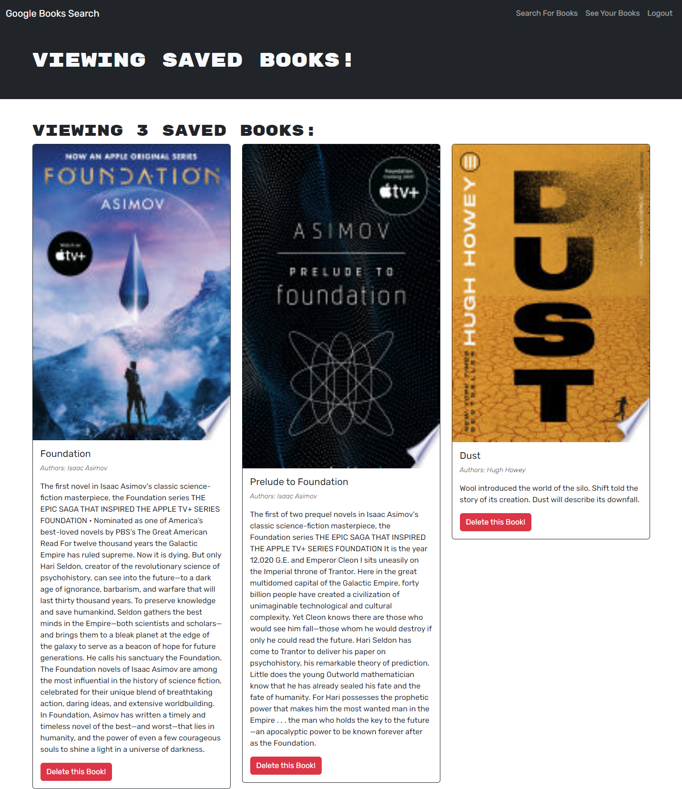

# Google Book Search Engine

## Description
A Google Books API search engine built with the MERN stack and GraphQL.

## Usage

To visit this site, please click on the link below. Once there, you can search for books using the input bar and any found with the searched title will appear in the main body of the page with an image of the book, name, author and a description. If you would like to be able to save books, you can click the "Login/Signup" link in the top right of the page. Once signed up or logged in, you will be able to save and delete books to your personal profile.

[Link to Book Search site](https://secret-headland-26073-309d39089dd8.herokuapp.com/saved)

Screenshot of the site:

## Credits

Special thanks to Leif Hetland and Fred Kamm, our class instructors, for teaching and support for this material and also oft needed morale boosting. I referenced code guidance from the class repository to assist with this project.

In completing this project, I utilized the below resources to assist:

https://www.apollographql.com/docs/  
https://www.apollographql.com/docs/apollo-server/data/resolvers/#resolver-arguments  
https://jwt.io/  
https://react.dev/learn  

## License

This project is covered under the MIT License.

## Badges

## Questions

Please visit my [GitHub profile](https://github.com/kevinsmithseven/) or email me at [kevinsmithseven@gmail.com](mailto:kevinsmithseven@gmail.com) with any questions.

